# StudyBuild Customer Analysis — Phase 2

## Project Overview

This project is the second phase of the StudyBuild online-store customer project. It uses the cleaned customer-level dataset produced in Phase 1 to answer six business questions covering customer profiling, advertising investment, loyalty prioritization, inactivity risk, behavioral comparisons, and an executive summary.

The analysis is descriptive: it identifies patterns in the available customer records to support practical decisions. It does not claim that an observed characteristic directly causes customer behavior.

## Dataset Description

**Source:** `data/cleaned_dataset_FatemehDehghan224.xlsx` (sheet: `customers`)

The cleaned dataset contains 60 unique customers and 17 columns. It includes demographic, location, membership, purchasing, recency, satisfaction, device, payment, discount, and return-related fields. The Phase 1 cleaning workflow removed duplicate records, resolved missing and invalid values, standardized locations, aligned gender values with the reviewed name mapping, and validated spending calculations.

The analysis notebook checks the columns required for each question before calculating summaries or creating charts. All 60 customers had complete values for the variables used in Questions 1–5, so no additional rows were excluded from those analyses.

## Repository Structure

```text
FatemehDehghan224/
├── analysis_code/
│   └── customer_profile_analysis.ipynb
├── assets/
│   └── charts/                         # Charts reproduced from notebook outputs
├── data/
│   └── cleaned_dataset_FatemehDehghan224.xlsx
├── requirements.txt
└── README.md
```

`customer_analytics_results.xlsx` can optionally be generated by enabling `EXPORT_RESULTS = True` in the final section of the notebook. The export collects the principal validated analysis tables in separate worksheets.

## Requirements and Execution

The notebook uses Python, pandas, openpyxl, matplotlib, and JupyterLab.

```powershell
python -m pip install -r requirements.txt
jupyter lab analysis_code\customer_profile_analysis.ipynb
```

Run the notebook cells in order from the repository root (or open the notebook in JupyterLab and run all cells). The notebook locates the project root automatically and reads the cleaned workbook from `data/`.

## Analysis Method

- Customer-level summaries are used throughout; each row represents one customer, not one order.
- Counts and percentages are shown for categorical customer-profile variables.
- City recommendations combine normalized total customer spending (40%), average customer spending (30%), and average satisfaction (30%). Cities with fewer than three customers are excluded.
- Loyalty candidates are ranked with a transparent weighted score: total spending (35%), purchase count (30%), recency (20%), and satisfaction (15%). Values are min–max normalized before scoring.
- A customer is classified as high-value and at risk only if all three conditions hold: spending at or above the 75th percentile, purchase count at or above the median, and days since the latest purchase at or above the 75th percentile.
- Discount, device, and payment-method comparisons are descriptive group comparisons. Groups with fewer than three customers are excluded.

## Business Questions and Findings

### Question 1 — Who are the store’s main customers?

**Approach.** The analysis grouped customers by age, converted the binary gender field to readable labels, and calculated counts and shares for gender, age group, membership tier, device, and payment method.

**Findings.** The largest age segment is 55–64 (16 customers, 26.7%), followed by 45–54 (15, 25.0%). The average customer age is 43.7 years and the median is 45. The customer base is 58.3% male (35 customers) and 41.7% female (25 customers). Gold is the largest membership tier (19, 31.7%), closely followed by Bronze (18, 30.0%). Android is the most common device (22, 36.7%), while Online Wallet is the most common payment method (23, 38.3%).

**Decision implication.** The strongest initial audience is customers aged 45–64. Campaign journeys should be tested carefully on both Android and web because their usage levels are close. Gold customers are the primary loyalty segment, but Bronze customers are numerous enough to remain an important growth audience.

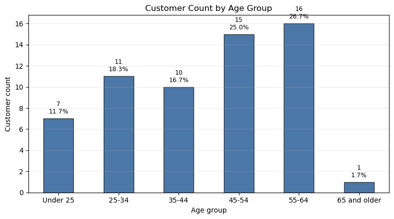

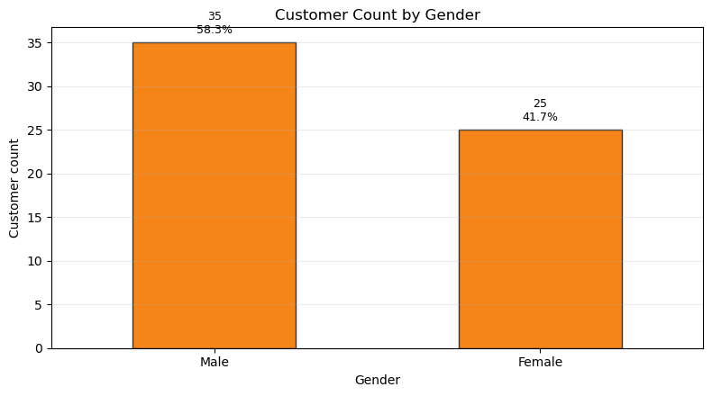

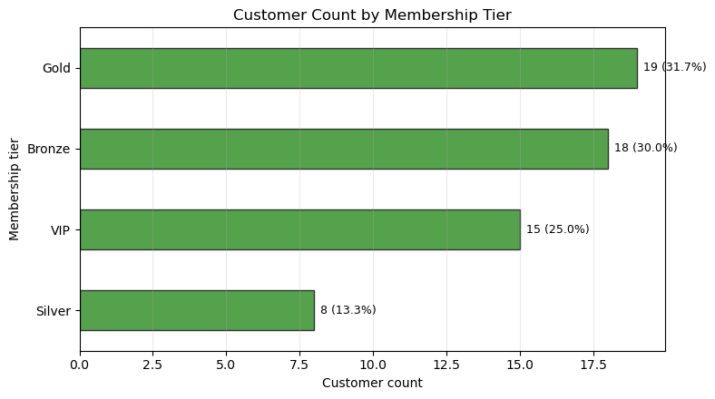

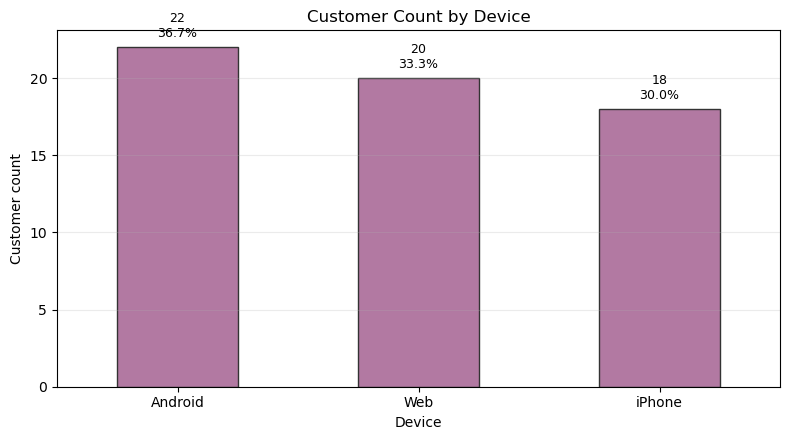

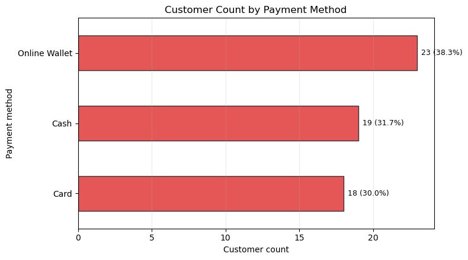

### Question 2 — Which province and city are most suitable for advertising investment?

**Approach.** Customer records were aggregated by the province–city combination. The decision score combines total customer spending (40%), average customer spending (30%), and average satisfaction (30%). This weighs market scale and customer value alongside customer experience.

**Findings.** Mashhad, Khorasan Razavi ranks first with a priority score of 0.74. It has 11 customers, the highest observed total customer spending (43,197.58), average customer spending of 3,927.05, and average satisfaction of 2.91/5. Isfahan is the recommended alternative pilot: it has the highest average customer spending (4,395.06) and satisfaction (4.40/5), but only five customers and lower total spending (21,975.32).

**Decision implication.** Start with a measured advertising pilot in Mashhad and monitor both financial return and satisfaction. Test Isfahan as a smaller, high-satisfaction alternative market. The results show an observed market ranking, not proof that advertising will cause the same outcomes.

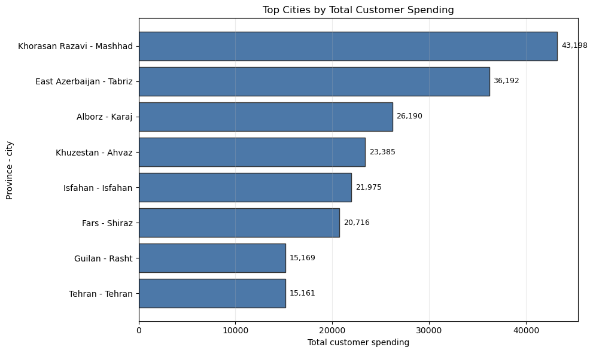

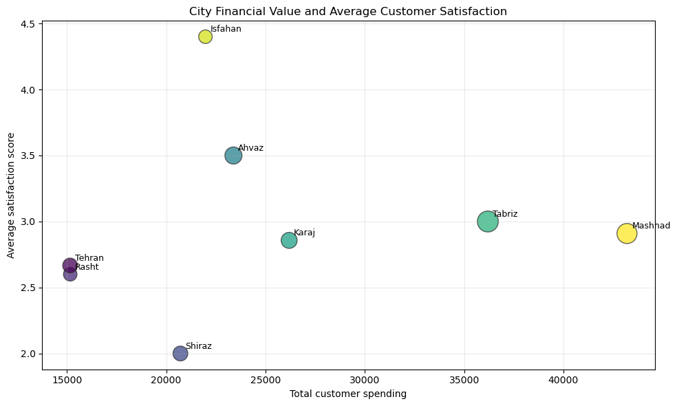

### Question 3 — Which customers should receive priority for the loyalty program?

**Approach.** Customers were ranked using a weighted loyalty score based on total spending (35%), purchase count (30%), recency (20%), and satisfaction (15%). The top 10 customers were selected, rather than relying on membership tier alone.

**Findings.** Maryam (customer ID 1057) is the highest-priority customer, with a loyalty score of 0.865, total spending of 13,532.74, 31 purchases, 82 days since the last purchase, and satisfaction of 4/5. The selected group spans Gold (4 customers), VIP (3), Bronze (2), and Silver (1), confirming that membership tier alone would not produce the same priority list. The group’s average time since the last purchase is 148.1 days.

**Decision implication.** Offer the top 10 customers tailored loyalty benefits. Customers with high historical spending but less-recent activity should receive a re-engagement-oriented offer and have their response monitored.

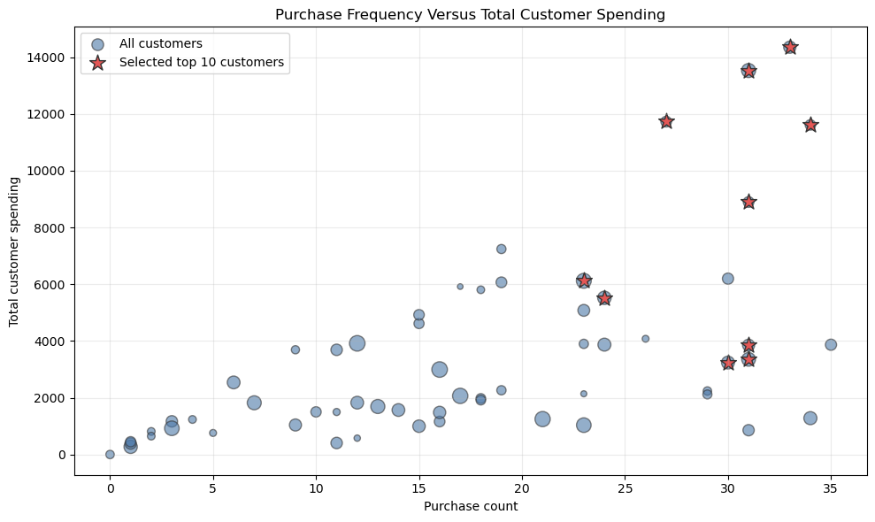

### Question 4 — Which high-value customers are at risk of becoming inactive?

**Approach.** A customer was flagged only when all three thresholds were met: total spending of at least 4,213.12 (75th percentile), purchase count of at least 17 (median), and 273.75 or more days since the last purchase (75th percentile).

**Findings.** Three customers meet the high-value inactivity-risk rule: Arash (ID 1010), Arash (ID 1035), and Sina (ID 1053). Arash (ID 1010) is the first contact priority because their total spending is the highest in the target list (7,241.47). Two of the three selected customers have low satisfaction scores (1–2).

**Decision implication.** Begin a segmented retention campaign immediately. For low-satisfaction customers, start with service recovery and feedback collection before offering a discount. This is an observed-risk flag, not a prediction that the customers will definitely churn.

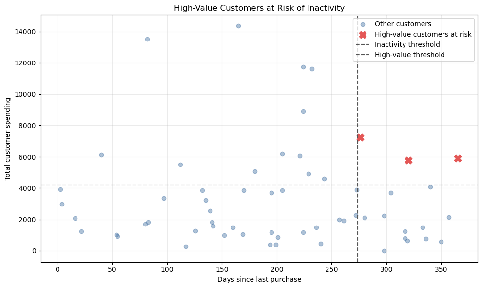

### Question 5 — How are discount use, device, and payment method related to customer behavior?

**Approach.** The analysis compared average total spending, purchase count, average order value, returned-item count, and satisfaction by discount use, device, and payment method. Medians and group sizes were retained as robustness checks; all device and payment groups contain at least 18 customers.

**Findings.** Discount users (n=26) have lower observed average total spending than non-users (n=34): 2,882.17 versus 3,736.74, a difference of −22.9%. Their purchase frequency is nearly identical (17.50 versus 17.29), but their average order value is lower (203.29 versus 220.70). Discount users also have fewer returned items on average (3.58 versus 3.97) and higher satisfaction (3.27 versus 2.76).

By device, iPhone customers have the highest mean total spending (3,773.94; n=18), followed by Android (3,459.07; n=22) and Web (2,897.76; n=20). Android has the highest median spending, so a small number of high-value iPhone customers may be raising the iPhone mean. By payment method, Card has the highest mean and median total spending (3,929.00; n=18), making that ranking more consistent. Cash customers have the highest observed satisfaction and purchase frequency, while Online Wallet customers have the lowest average satisfaction.

**Decision implication.** Do not expand discounting on the assumption that discount users are higher-spending or return more items; the available data shows neither pattern. Consider a focused test for Card payment users, and investigate the lower satisfaction among Online Wallet users. These are associations only and do not establish causality.

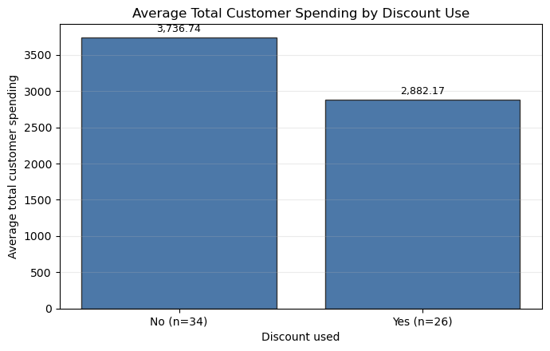

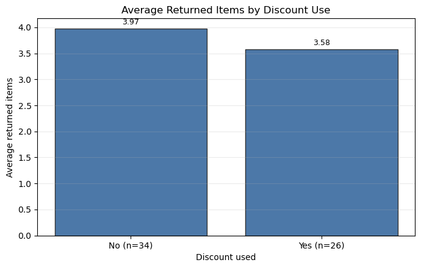

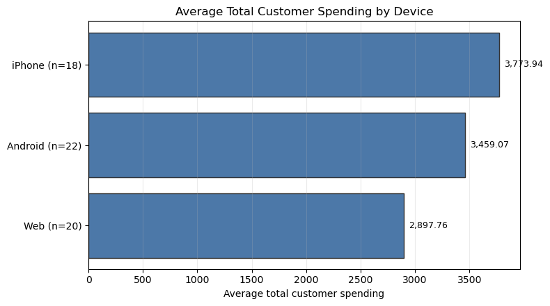

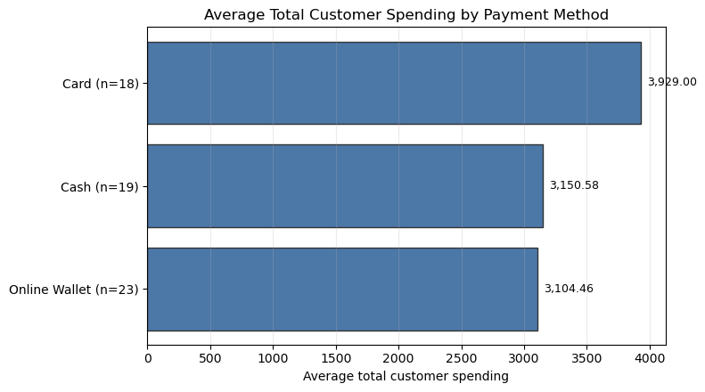

### Question 6 — What should management understand and act on within five minutes?

**Approach.** The executive dashboard reuses the validated results from Questions 1–5. It presents six KPIs, three decision-oriented charts, and three KPI → action → evidence recommendations rather than rebuilding the analysis from raw columns.

**Findings.** The data contains 60 customers with 201,985.73 in observed total customer spending. Average spending is 3,366.43 per customer, average purchase count is 17.38, and average satisfaction is 2.98/5. Three customers (5.0% of the customer base) are high-value and at risk of inactivity. The key management actions are to pilot advertising in Mashhad, launch targeted retention for the three at-risk customers, and avoid broad discount expansion until it is tested against a clear business objective.

**Decision implication.** The dashboard is designed as a concise management view: it connects each recommendation to evidence from the detailed analyses while keeping the results suitable for immediate prioritization.

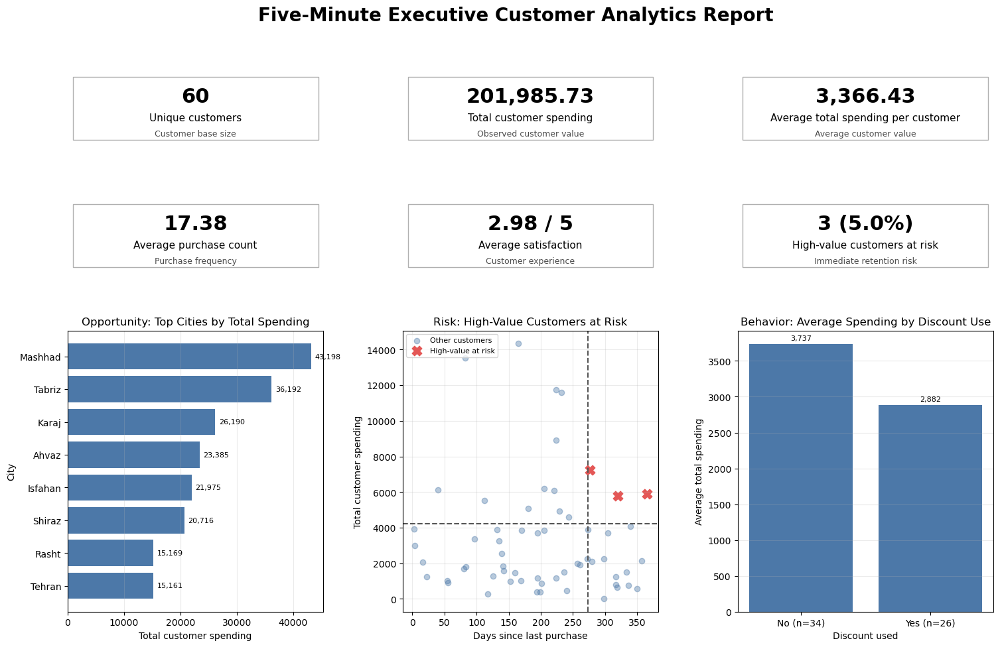

## Key Recommendations

1. Launch a measured advertising pilot in Mashhad, Khorasan Razavi, and evaluate financial response together with customer satisfaction.
2. Test Isfahan as a smaller alternative market because it has the highest observed per-customer spending and satisfaction, while recognizing its small sample size.
3. Focus customer acquisition and campaign design on the 45–64 age range, with reliable Android and web experiences.
4. Offer tailored loyalty rewards to the ranked top-10 customer list; use re-engagement messaging for valuable customers whose latest purchase is less recent.
5. Contact the three high-value inactive customers immediately. Address service issues before sending incentives to customers with low satisfaction.
6. Do not treat discounts as a proven way to increase spending. Run controlled tests before changing discount policy, and review Online Wallet satisfaction separately.

## Limitations

- The dataset has 60 customers, so results are suitable for descriptive prioritization and follow-up testing rather than broad generalization.
- Each record is a customer-level summary. The project does not contain individual order records or a complete purchase timeline.
- `last_purchase_days` measures time since the latest purchase but cannot prove churn or explain why a customer became inactive.
- The city, discount, device, and payment-method results are observational associations; they do not establish cause-and-effect relationships.
- `returned_items` is a count, not a true return rate, because the number of items purchased is unavailable.
- High-value customers were intentionally preserved during Phase 1 cleaning. This is appropriate for customer-value analysis, but high values can influence group means; medians are therefore included where relevant.
- City estimates for small groups, particularly Isfahan (n=5), are less stable and should be validated with a pilot.

## Deliverables

- `analysis_code/customer_profile_analysis.ipynb` — complete Phase 2 analysis, tables, charts, and written interpretations.
- `data/cleaned_dataset_FatemehDehghan224.xlsx` — cleaned input dataset from Phase 1.
- `assets/charts/` — chart images embedded in this README.
- `customer_analytics_results.xlsx` — optional multi-sheet results workbook, generated from the notebook when export is enabled.
